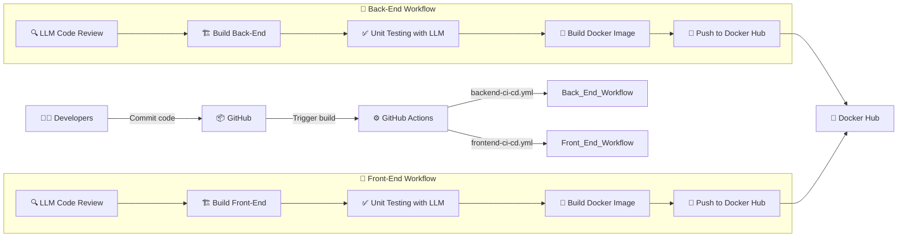

```mermaid
graph LR
    %% Developers
    Developers["👨‍💻 Developers"] -->|Commit code| GitHub["📦 GitHub"]

    %% GitHub triggers GitHub Actions
    GitHub -->|Trigger build| GitHub_Action["⚙️ GitHub Actions"]

    %% GitHub Actions splits into two workflows
    GitHub_Action -->|backend-ci-cd.yml| Back_End_Workflow
    GitHub_Action -->|frontend-ci-cd.yml| Front_End_Workflow

    %% Back-End Workflow with pseudo-icons
    subgraph "🔗 Back-End Workflow"
        LLM_Code_Review_BE["🔍 LLM Code Review"] --> Build_BE["🏗️ Build Back-End"]
        Build_BE --> Unit_Testing_BE["✅ Unit Testing with LLM"]
        Unit_Testing_BE --> Docker_Build_BE["🐳 Build Docker Image"]
        Docker_Build_BE --> Push_BE["🚀 Push to Docker Hub"]
    end

    %% Front-End Workflow with pseudo-icons
    subgraph "🔗 Front-End Workflow"
        LLM_Code_Review_FE["🔍 LLM Code Review"] --> Build_FE["🏗️ Build Front-End"]
        Build_FE --> Unit_Testing_FE["✅ Unit Testing with LLM"]
        Unit_Testing_FE --> Docker_Build_FE["🐳 Build Docker Image"]
        Docker_Build_FE --> Push_FE["🚀 Push to Docker Hub"]
    end

    %% Push to Docker Hub
    Push_BE --> Docker_Hub["🐋 Docker Hub"]
    Push_FE --> Docker_Hub                        
```